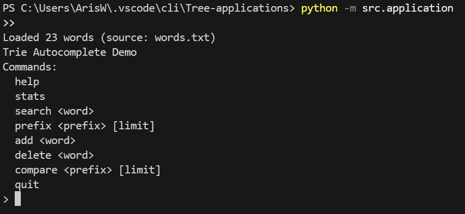
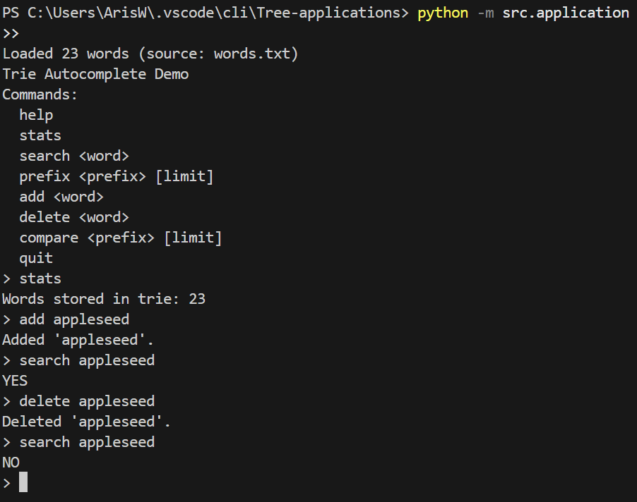
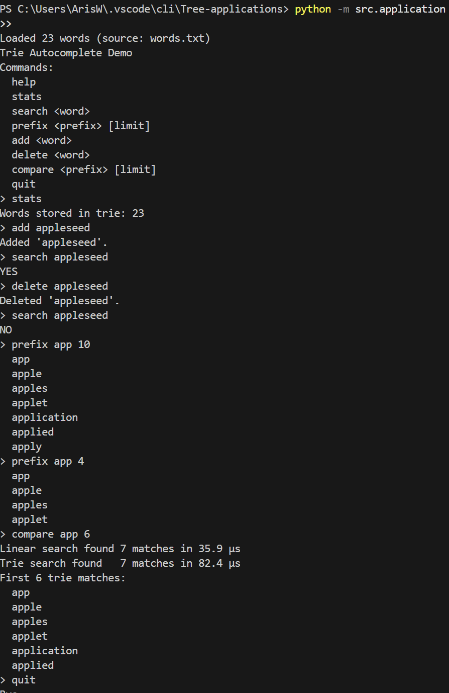

# Trie Autocomplete – Tree Application Project

## Project Description

This project implements a **Trie (prefix tree)** in Python and uses it to build a simple **command-line autocomplete application**.

The application:

- Loads a list of words from `data/words.txt` into a Trie.
- Lets the user:
  - Check if a word exists (`search`).
  - Get autocomplete suggestions for a prefix (`prefix`).
  - Add new words (`add`).
  - Delete words (`delete`).
  - See how many words are stored (`stats`).
  - Compare Trie-based prefix search performance with a naive linear search (`compare`).

The goal is to demonstrate why a tree (Trie) is more suitable than a plain list for prefix-based operations.

---

## Tree Implemented

- **Tree Type:** Trie (Prefix Tree)
- **Key Operations:**
  - `insert(word: str) -> None`
  - `search(word: str) -> bool`
  - `starts_with(prefix: str) -> bool`
  - `get_words_with_prefix(prefix: str, limit: Optional[int] = None) -> List[str]`
  - `delete(word: str) -> bool`
  - `count_prefix(prefix: str) -> int`
  - `size() -> int`
  - `is_empty() -> bool`

Time/space complexity details and interface design are documented in [`TREE_DESIGN.md`](./TREE_DESIGN.md).

---

## Who Would Use This and Why?

Potential users:

- **Students** learning about trees and Tries.
- **Developers** who want a simple text-based autocomplete system.
- **Word game players** who want fast prefix-based lookups.

The application shows how the Trie provides **fast prefix lookups** in time proportional to the length of the prefix, rather than the number of stored words.

---

## Team Members

- Aris Whitney

---

## Installation & Setup

### Prerequisites

- Python 3.10+ recommended
- `pip` for installing dependencies (optional, only needed for tests)

### Setup Steps

1. Clone or download this repository.

2. Ensure the project structure looks like:

   ```text
   trie-autocomplete/
   ├── README.md
   ├── TREE_DESIGN.md
   ├── requirements.txt
   ├── data/
   │   └── words.txt
   ├── src/
   │   ├── trie.py
   │   └── application.py
   ├── tests/
   │   └── test_trie.py
   └── screenshots/
       └── (PNG screenshots)

3. pip install -r requirements.txt


## How to Run the Application

From the project root:

python -m src.application


You can optionally pass a custom word list:

python application.py ../data/words.txt

## Usage Guide

When the app starts, you’ll see:

Loaded X words (file: words.txt)
Trie Autocomplete Demo
Commands:
  help
  stats
  search <word>
  prefix <prefix> [limit]
  add <word>
  delete <word>
  compare <prefix> [limit]
   quit
>


 ### Commands

help- 
Show the list of available commands.

stats-
Print the number of words currently stored in the Trie.

search <word>
Check if <word> exists in the Trie. Prints YES or NO.

prefix <prefix> [limit]
Show up to limit (default 10) words that start with <prefix>.

add <word>
Add <word> to the Trie.

delete <word>
Delete <word> from the Trie if it exists.

compare <prefix> [limit]
Compare:

Naive linear search over all words

Trie-based prefix search

It prints how many matches each found and how long each search took.

quit / exit / q
Exit the application.

### Example Session
> stats
Words stored in trie: 19
> search apple
YES
> search appl
NO
> prefix app 5
  apple
  application
  applied
  app
  applet
> add appl
Added 'appl'.
> search appl
YES
> delete appl
Deleted 'appl'.
> compare app 5
Linear search found 7 matches in 250.1 µs
Trie search found   7 matches in 45.3 µs
First 5 trie matches:
  app
  apple
  application
  applied
  applet
> quit
Bye.

## Screenshots/ Demos

### 1. Application Startup
Shows the program starting, loading words, and displaying available commands



### 2. Core Trie Operations
Shows the use of some of the core operations



### 3. Prefix Autocomplete and performance comparison
Shows the prefix search along with perforamnce comparisons



## Tree Implementation Summary

The Trie is implemented in src/trie.py
 with:

A TrieNode containing:

children: Dict[str, TrieNode]

is_end: bool

A Trie class that tracks:

_root: TrieNode

_size: int (number of distinct words)

Key operation complexities:

insert(word) – O(m)

search(word) – O(m)

starts_with(prefix) – O(p)

get_words_with_prefix(prefix) – O(p + k * L)

delete(word) – O(m)

count_prefix(prefix) – O(p + T)

size() – O(1)

See TREE_DESIGN.md for detailed complexity analysis.

Evolution of the Interface

Initial planned operations:

insert

search

starts_with

get_words_with_prefix

delete

While building the application, additional needs appeared:

size() – to implement the stats command.

is_empty() – to make it easy to check if the Trie has any words.

count_prefix() – to support reporting how many words share a prefix and for potential extensions.

These methods were added, the interface was updated, and TREE_DESIGN.md was updated.

## Challenges & Solutions

Delete with pruning:
Removing a word while cleaning up unused nodes required recursion and careful returns. A helper function signals when a subtree can be safely pruned.

Balancing interface vs app needs:
Initially, the interface was minimal. As the CLI design evolved, new methods were added rather than overloading existing ones, which kept the code readable.

Performance comparison implementation:
To compare linear search with Trie search, all words are materialized into a list once, and then prefix checks are done both linearly and via Trie. This makes the performance difference visible and intuitive.

## Future Enhancements

Possible extensions:

Track word frequencies to rank autocomplete suggestions.

Add fuzzy matching (edit distance).

Implement a small GUI (e.g. with Tkinter or a simple web front-end).

Serialize the Trie to disk for faster startup.